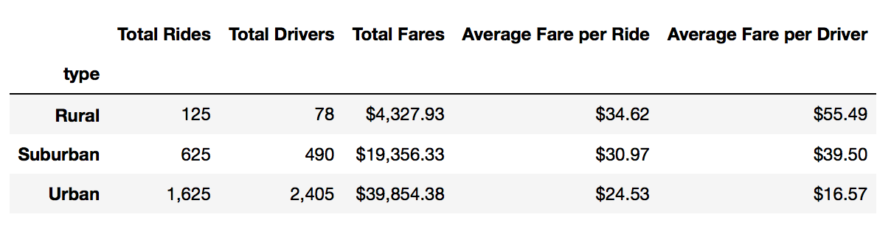
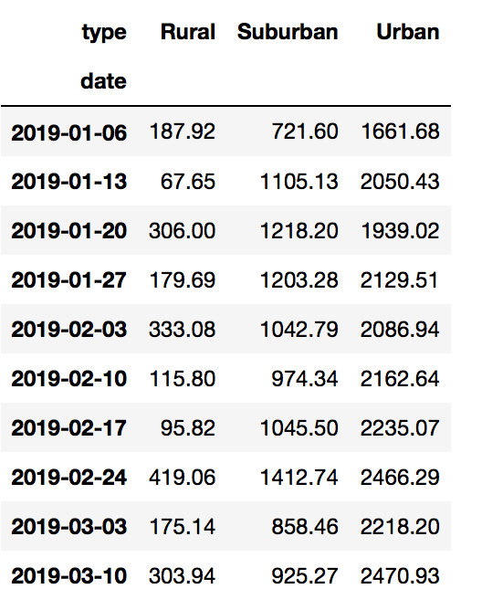
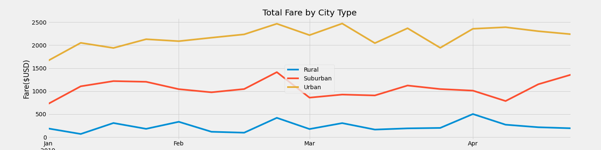

# PyBer_Analysis

## Overview of the Analysis:
This project focuses on analyzing the ride-sharing data by city type. We will be using Python skills and knowledge of Pandas to create a summarized DataFrame. Furthermore, we will include a multiple-line graph using Pandas and Matplotlib to present the total weekly fares for each city type. As an result, the project will address the total rides, total drivers, total fares, average fare per ride, and average fare per drive by city type; and a multiple-line graph showing the sum of the fares for each week from 2019-01-01 to 2019-04-29.

## Results:
After we run the code, we conclude that Urban area has the highest total rides, total drivers, and total fares among the city type.
  Please see Figure 1 for details:

  Figure 1: PyBer_summary_DataFrame
  As shown in Figure 1, the lowest result for total rides, total drivers, and total fares is Rural area. Yet, it has the highest average fare per ride and average fare per driver. This means it is more expensive per ride in the Rural area because the fares are high with less amount of drivers and rides.

  The second part of this analysis is mainly focusing on the sum of weekly fares from 2019-01-01 to 2019-04-29. As we can see from Figure 2, Urban area has outperformed the city type each week. Also, Rural area has remained the least amount of fares, and Suburban has booked the second place for both analysis.

  Figure 2: Weekly_Fare_by_Type

  Finally, we put the result of the second analysis into a multiple-line graph. From the graph we can say that the total weekly fare of Urban area has outperformed the total weekly fare of Suburban and Rural area. Also, all three city types have had an increase of total fares at week 2019-02-24. Please see Figure 3 for more details.  

  Figure 3: Total_Fare_by_City_Type

## Summary: 
From the three Figures above we can conclude that the customers will pay the most in Rural area where the need of rides is low; the drivers will receive the least in Urban area because the amount of drivers is higher than the total rides; Suburban would be the best area to expand the ride-sharing business because the need of ride and the total drivers is at a balanced level. Therefore we come up with the following recommendations for suggestion:
- PyBer should increase drivers at the Rural area to make sure the needs of rides are satisfied with less waiting time and less average fare per ride. However, the statistics show that the total rides in Urban is 13 times (1,625/125) more than Rural area, and the total rides in Suburban is 5 times (625/125) more than Rural area. So that, PyBer should not increase too many drivers at this area because the needs for ride-sharing in this area is low. Therefore, the driver size should increase to a certain amount to balance the needs and lower the pay-out-of-pocket for customers.
- PyBer should also increase drivers at the Suburban area to expand the business. As the analysis shown, the need of rides is somewhat high when the cost per ride isn’t so low. This means that the customers are willing to pay this amount to take the ride. Therefore, with more drivers at this area will not only lower the cost per ride, but also has an opportunity to increase the needs to rides.
- PyBer should decrease the drivers at the Urban area to ensure the average fare per driver isn’t too low. The need for ride-sharing at Urban area is obviously high, but the drivers are 1.48 times (2,405/1,625) more than the total rides that lead to a lower average fare per driver. PyBer could suggest some Urban drivers to relocate to Suburban and Rural area to expand the business with higher payoff.

